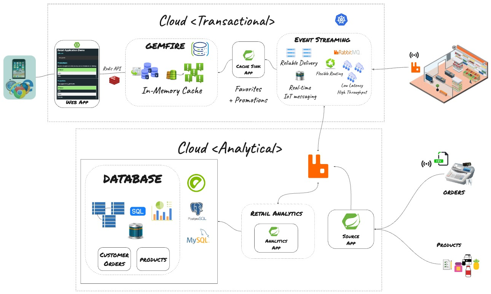

# Modern Data Architecture with Spring 

Most applications are not useful without data. Come and see how easy it is to integrate, analyze and consume data using Spring.

We’ll walk through how to use spring projects such as Spring to build data pipelines for data movement. Learn how easy it is to consume data services in your Spring Boot applications using Spring Data. We will demonstrate running realtime data analytics on Kubernetes, powered by Spring.

Spring Data is the de-facto standard for data access within the Spring ecosystem, and Spring Cloud provides multi-cloud data integration for a large number of real-life use cases, including data analytics. Spring makes it easy to work with VMware products such as VMware Data Solutions (SQL, GemFire, RabbitMQ) and Observability.

Instructors: miverson@vmware.com, demetriousr@vmware.com , gregoryg@vmware.com

Pre-requisites

- Latest version of Chrome
- OS/LINUX command line
- Basic database and messaging system knowledge
- Java 17 or higher and Java development experience
- Container/Kubernetes skills

### GemFire for Redis Applications - Build Dependency

Note: This repository uses GemFire for Redis.
GemFire for Redis is free to use for local development.

In order to build Please following the instruction [here]((https://docs.vmware.com/en/VMware-GemFire/10.0/gf/getting_started-installation-obtain_gemfire_maven.html)) to setup your credentials in your .m2/settings.xml file to access the 
dependencies in the [GemFire maven repository](https://docs.vmware.com/en/VMware-GemFire/10.0/gf/getting_started-installation-obtain_gemfire_maven.html).

# Spring Modern Data Architecture Project - Outcomes

-	Spring Boot Web App real-time access from GemFire
-	Spring Boot App producer of real-time data to RabbitMQ
-	Spring App for data analytics using (Postgres, MySQL or Greenplum) and RabbitMQ to pushes data to GemFire
-	Integrate Monitoring analytics with Spring Boot applications (optional)

Agenda

- Overview
  - EPIC: Given a customer we will provide a list of product recommendations based on their buying history and product reviews

120 min session / 75 attendee max per workshop
