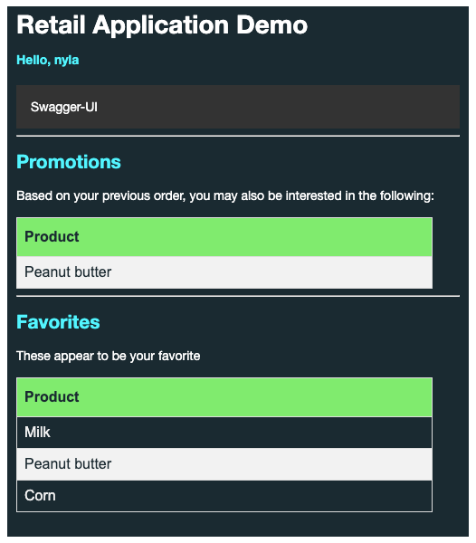

# Modern Data Architecture with Spring 

Most applications are not useful without data. Come and see how easy it is to integrate, analyze and consume data using Spring.

This project provides a reference implement on how to use spring projects such as [Spring Cloud Stream](https://spring.io/projects/spring-cloud-stream) to build data pipelines for data movement. Learn how easy it is to consume data services in your [Spring Boot](https://spring.io/projects/spring-boot) applications using [Spring Data](https://spring.io/projects/spring-data) . We will demonstrate running realtime data analytics on [Kubernetes](https://tanzu.vmware.com/kubernetes-grid/), powered by [Spring](https://spring.io/.

[Spring Data](https://spring.io/projects/spring-data) is the de-facto standard for data access within the Spring ecosystem, and [Spring Cloud](https://spring.io/projects/spring-cloud) provides multi-cloud data integration for a large number of real-life use cases, including data analytics. Spring makes it easy to work with VMware products such as VMware Data Solutions ([VMware SQL](https://www.vmware.com/products/sql.html), [VMware GemFire](https://www.vmware.com/products/gemfire.html) for [Redis Apps](https://tanzu.vmware.com/content/blog/introducing-vmware-tanzu-gemfire-for-redis-apps), [VMware RabbitMQ](https://www.vmware.com/products/rabbitmq.html) and or [VMware Greenplum](https://www.vmware.com/products/greenplum.html))) .


Instructors: miverson@vmware.com, demetriousr@vmware.com , gregoryg@vmware.com

Pre-requisites

- Latest version of Chrome
- OS/LINUX command line
- Basic database and messaging system knowledge
- Java 17 or higher and Java development experience
- Container/Kubernetes skills

### GemFire for Redis Applications - Build Dependency

Note: This repository uses [GemFire for Redis](https://docs.vmware.com/en/VMware-GemFire-for-Redis-Apps/1.1/gf-for-redis-apps/about.html).
GemFire for Redis is free to use for local development.

In order to build Please following the instruction [here]((https://docs.vmware.com/en/VMware-GemFire/10.0/gf/getting_started-installation-obtain_gemfire_maven.html)) to setup your credentials in your .m2/settings.xml file to access the 
dependencies in the [GemFire maven repository](https://docs.vmware.com/en/VMware-GemFire/10.0/gf/getting_started-installation-obtain_gemfire_maven.html).

Demo/Records/Webinars

- [Retail supply chain volatility and improve resiliency through data visibility, intelligence and automation](https://www.brighttalk.com/webcast/14883/571251?utm_source=brighttalk-portal&utm_medium=web&utm_campaign=all-brighttalk&utm_content=recorded)
- [Multi-Cloud Native Data with Spring and VMware Data Solutions](https://www.vmware.com/explore/video-library/video-landing.html?sessionid=1679079685784001CLge&videoId=6335593213112) (VMware Explore)
- [Tanzu Application Service and VMware Data Solutions](https://www.vmware.com/explore/video-library/video-landing.html?sessionid=1683899525801001iaCG&videoId=6335272435112)  (VMware Explore)

# Spring Modern Data Architecture Project - Outcomes



- Spring Boot Web App real-time access from GemFire
- Spring Boot App sink application to populate data from RabbitMQ
- Spring App for data analytics using (Postgres, MySQL or Greenplum) and RabbitMQ to pushes data to GemFire
Spring Boot App source to provide API integration interfaces to send to RabbitMQ


# Project Overview

| Path                                                          | Note                                                                                                                                                                                                      |
|---------------------------------------------------------------|-----------------------------------------------------------------------------------------------------------------------------------------------------------------------------------------------------------|
| [retail-web-app](applications/retail-web-app)                 | Customer portal web application to view product favorites and real-time promotions                                                                                                                        |
| [retail-analytics-app](applications/retail-analytics-app)     | Calculates real-time customer favorites/promotions analytics and saves customer order/product into the database.                                                                                          |
| [retail-cache-sink-app](applications/retail-cache-sink-app)   | Saves customer favorites and [performs pub/sub](https://redis.io/docs/interact/pubsub/) of promotions using [GemFire for Redis Apps](https://docs.vmware.com/en/VMware-GemFire-for-Redis-Apps/index.html) |
| [retail-source-app](applications/retail-source-app)           | Exposes an HTTP API interface to receive product catalog in JSON and customer orders in CSV                                                                                                               |
| [jdbc-sql-console-app](applications/jdbc-sql-console-app)     | Generic application to perform SQL query in a configured database                                                                                                                                         | 
| [spring-gf-locator](applications/spring-gf-locator)           | Spring Boot with [Embedded GemFire locator](https://docs.vmware.com/en/VMware-GemFire/10.0/gf/configuring-running-running_the_locator.html)                                                               |
 | [spring-gf-redis-server](applications/spring-gf-redis-server) | Spring Boot Redis Server with [Embedded GemFire cache server](https://docs.vmware.com/en/VMware-GemFire/10.0/gf/configuring-running-running_the_cacheserver.html)                                         |

# Building Applications

Note this projects requires Java version 17.
Set the JAVA_HOME environment prior to building the application.

Building the application
```shell
./mvnw package
```


