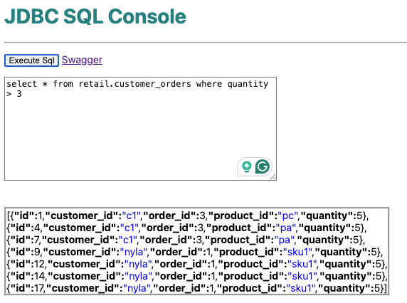

# jdbc-sql-console-app


Spring Boot application that provides a GUI to perform SQL on in Postgres or MySQL databases.





## Configuration


| Properties                 | Notes                                                             |
|----------------------------|-------------------------------------------------------------------|
| spring.datasource.url      | Database connection string  Ex: jdbc:mysql://<HOST>:<PORT>/mysql" |
| spring.datasource.username | Database account name credentials                                 |
| spring.datasource.password | Database account password credentials                             |


Running the console

```shell
java -jar target/jdbc-sql-console-app-0.0.2-SNAPSHOT.jar --spring.datasource.url="jdbc:mysql://<HOST>:<PORT>/mysql" --spring.datasource.username=${USER} --spring.datasource.password=${MYSQL_DB_PASSWORD}
```

Running on Docker

```properties
docker run -p 7280:7280 cloudnativedata/jdbc-sql-console-app:0.0.2-SNAPSHOT --server.port=7280 --spring.datasource.url=jdbc:postgresql://host.docker.internal:5432/postgres --spring.datasource.username=postgres
```


## Tutorial 

You access UI to execute queries

```shell
open http://localhost:<Port>/
```

Example
```shell
open http://localhost:7280
```

Example Query using CURL

```shell
curl -X 'POST' \
'http://localhost:7280/query' \
-H 'accept: */*' \
-H 'Content-Type: application/json' \
-d 'SELECT * FROM customer_orders limit 10'
```

-----------------------------------------------------------
## Docker building image

```shell
mvn install
cd applications/jdbc-sql-console-app
mvn package
docker build  --platform linux/amd64,linux/arm64 -t jdbc-sql-console-app:0.0.2-SNAPSHOT .
```

```shell
docker tag jdbc-sql-console-app:0.0.2-SNAPSHOT cloudnativedata/jdbc-sql-console-app:0.0.2-SNAPSHOT
docker push cloudnativedata/jdbc-sql-console-app:0.0.2-SNAPSHOT
```

------------------------------------------------------------

# Cloud Foundry


Push Applications
jdbc-sql-console-app
```shell
cf push jdbc-sql-console-app -f deployments/cloud/cloudFoundry/apps/jdbc-sql-console-app/jdbc-sql-console-app-postgres.yaml -p applications/jdbc-sql-console-app/target/jdbc-sql-console-app-0.0.2-SNAPSHOT.jar
```
