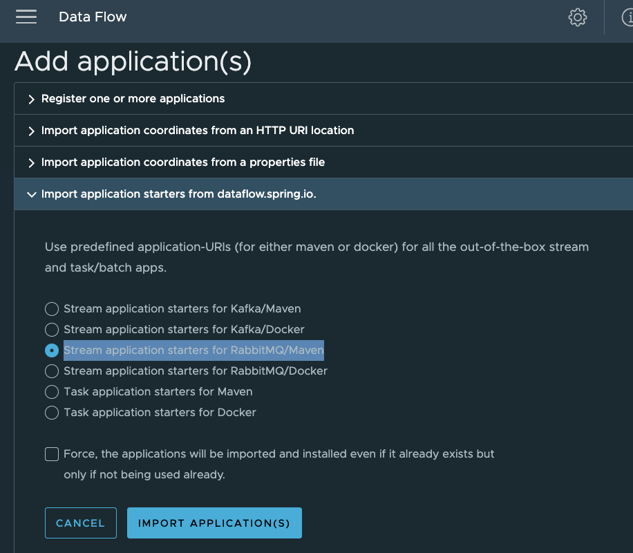
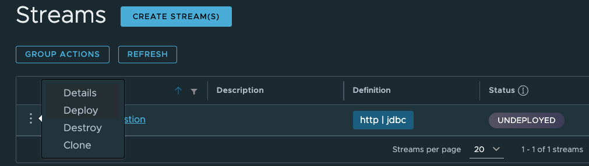
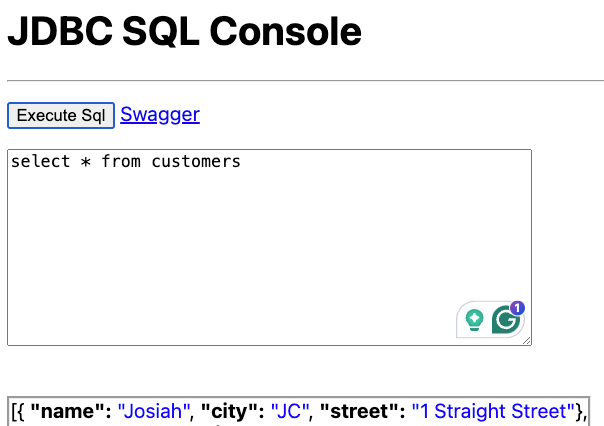

# Start RabbitMQ

Create the docker network (first time only)

```shell
docker network create tanzu
```


- Run RabbitMQ (user/bitnami)
```shell
docker run --name rabbitmq01  --network tanzu --rm -e RABBITMQ_MANAGEMENT_ALLOW_WEB_ACCESS=true -p 5672:5672 -p 5552:5552 -p 15672:15672  -p  1883:1883  bitnami/rabbitmq:4.0.4 
```

# Start Postgres


```shell
docker run --name postgresql --network tanzu  --rm  -e ALLOW_EMPTY_PASSWORD=true -p 5432:5432  bitnami/postgresql:latest
```


# Start SCDF


Download SCDF Jars (optional first time)

```shell
mkdir -p runtime/scdf
wget  --directory-prefix=runtime/scdf https://repo.maven.apache.org/maven2/org/springframework/cloud/spring-cloud-dataflow-server/2.11.5/spring-cloud-dataflow-server-2.11.5.jar
wget --directory-prefix=runtime/scdf https://repo.maven.apache.org/maven2/org/springframework/cloud/spring-cloud-skipper-server/2.11.5/spring-cloud-skipper-server-2.11.5.jar
wget --directory-prefix=runtime/scdf https://repo.maven.apache.org/maven2/org/springframework/cloud/spring-cloud-dataflow-shell/2.11.5/spring-cloud-dataflow-shell-2.11.5.jar
```


Start Skipper
```shell
java -jar runtime/scdf/spring-cloud-skipper-server-2.11.5.jar
```


Start Data Flow Server 
```shell
export SPRING_APPLICATION_JSON='{"spring.cloud.stream.binders.rabbitBinder.environment.spring.rabbitmq.username":"user","spring.cloud.stream.binders.rabbitBinder.environment.spring.rabbitmq.password":"bitnami","spring.rabbitmq.username":"user","spring.rabbitmq.password":"bitnami","spring.cloud.dataflow.applicationProperties.stream.spring.rabbitmq.username" :"user","spring.cloud.dataflow.applicationProperties.stream.spring.rabbitmq.password" :"bitnami"}'

java -jar runtime/scdf/spring-cloud-dataflow-server-2.11.5.jar
```


Open Dashboard

```shell
open http://localhost:9393/dashboard
```


Import Application

    Click Applications -> Add Applications -> import application starters from dataflow.spring.io -> Stream application starters for RabbitMQ/Maven




Create Stream with DSL

    Click Streams -> Create Streams(s)


Use Stream definition

```shell
data-ingestion=http --port=9001 | jdbc
```

Deploy Stream 



Using properties

```properties
app.http.server.port=9001
app.jdbc.spring.datasource.url=jdbc:postgresql://localhost:5432/postgres
app.jdbc.spring.datasource.username=postgres
app.jdbc.columns=name,city:address.city,street:address.street
app.jdbc.initialize=true
app.jdbc.table-name=customers
```

Insert Test Data
```json
{"name":"Josiah","address":{"city":"JC","street":"1 Straight Street"}}
```

```shell
curl -X POST http://localhost:9001  \
   -H 'Content-Type: application/json' \
    -d '{"name":"Josiah","address":{"city":"JC","street":"1 Straight Street"}}'
```


---------------

# View Data

Start JDBC console

```shell
java -jar applications/jdbc-sql-console-app/target/jdbc-sql-console-app-0.0.3-SNAPSHOT.jar --server.port=8800 --spring.datasource.url="jdbc:postgresql://localhost:5432/postgres" --spring.datasource.username=postgres
```

```shell
open http://localhost:8800
```

Execute SQL

```sql
select * from customers
```

